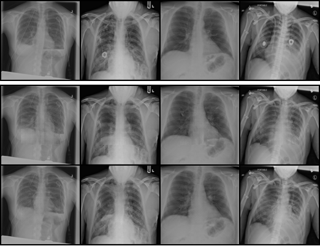
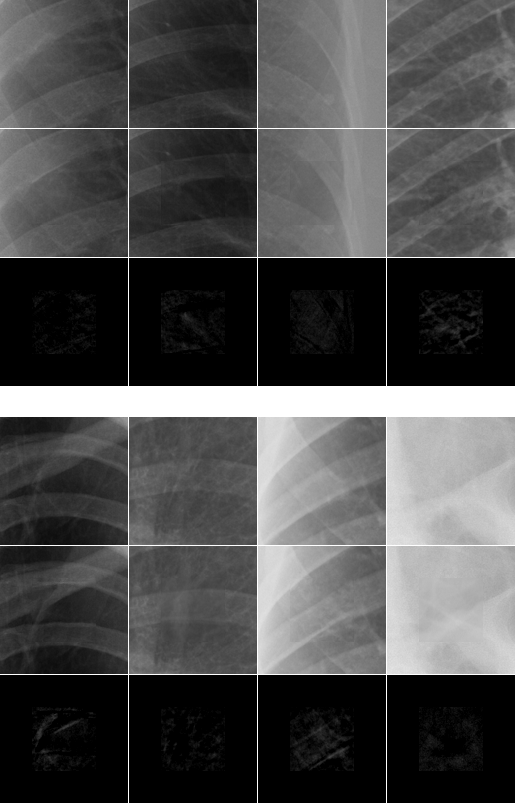
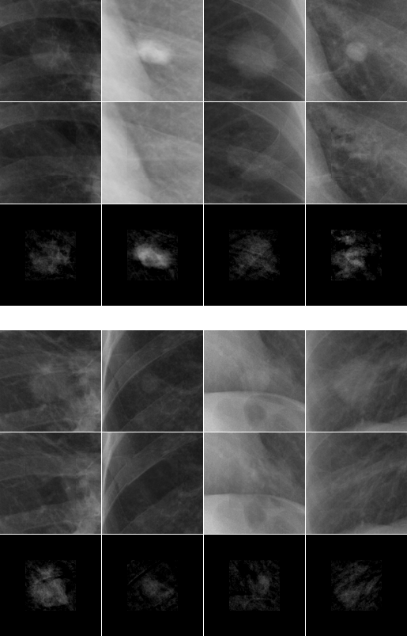

# Context-Encoder PyTorch Implementation for [Chest X-Rays Image Inpainting with Context Encoders](https://arxiv.org/abs/1812.00964)

Chest X-rays are one of the most commonly used technologies for medical diagnosis. Many deep learning models have been proposed to improve and automate the abnormality detection task on this type of data. In this paper, we propose a different approach based on image inpainting under adversarial training first introduced by Goodfellow et al. We configure the context encoder model for this task and train it over 1.1 M 128x128 images from healthy X-rays. The goal of our model is to reconstruct the missing central 64x64 patch. Once the model has learned how to inpaint healthy tissue, we test its performance on images with and without abnormalities. We discuss and motivate our results considering PSNR, MSE and SSIM scores as evaluation metrics. In addition, we conduct a 2AFC observer study showing that in half of the times an expert is unable to distinguish real images from the ones reconstructed using our model. By computing and visualizing the pixel-wise difference between source and reconstructed images, we can highlight abnormalities to simplify further detection and classification tasks.

Work based on [context-encoder-pytorch](https://github.com/BoyuanJiang/context_encoder_pytorch)

### Images

	

__Figure 1__: Sample image from ChestX-ray14 dataset

#### Final reconstructions of inpainted chest images

 

#### High resolution inpainting of smaller patches

Healthy patches             |  Unhealthy patches
:-------------------------:|:-------------------------:
 | 

